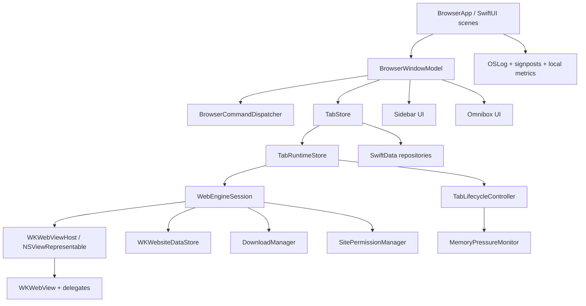
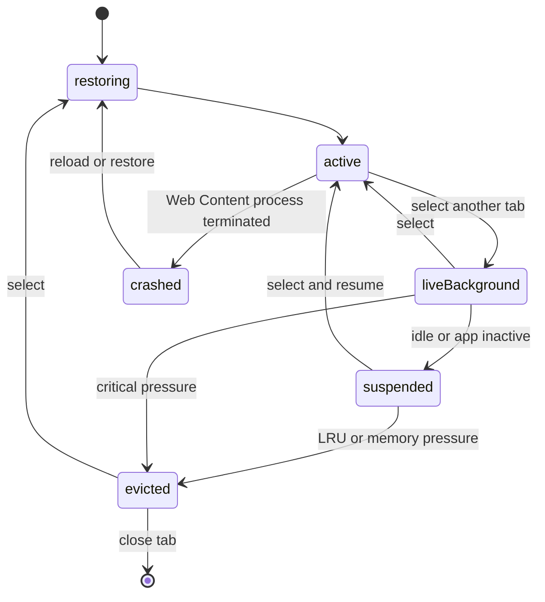
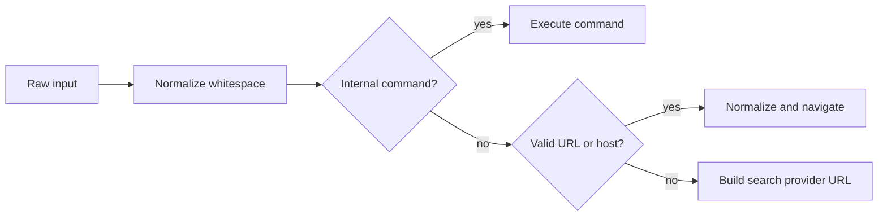

# Browser — техническая документация и план реализации

> Статус: draft v1  
> Целевая платформа: macOS 26+  
> Основной стек: Swift 6, SwiftUI, WebKit, SwiftData  
> Связанный документ: [PRODUCT_VISION.md](./PRODUCT_VISION.md)

## 1. Назначение документа

Этот документ переводит продуктовое видение Browser в реализуемую техническую систему. Он фиксирует:

- архитектурные решения;
- границы первой версии;
- устройство окна, sidebar и вкладок;
- интеграцию с WebKit;
- модель памяти и жизненный цикл страниц;
- хранение данных и восстановление сессии;
- безопасность, приватность и разрешения;
- применение Liquid Glass;
- тестовую и performance-стратегию;
- порядок реализации, зависимости и критерии готовности.

Документ рассчитан на разработку небольшой командой или одним разработчиком. Приоритет — сначала получить узкий, но надёжный браузерный вертикальный срез, затем расширять функциональность без переписывания ядра.

## 2. Зафиксированные технические решения

### 2.1. Минимальная версия системы

Первая версия поддерживает только **macOS 26 и новее**.

Причины:

- Liquid Glass является частью основной идентичности продукта;
- не требуется поддерживать параллельную визуальную систему для старых macOS;
- можно использовать актуальные SwiftUI API, Swift Concurrency и Observation;
- меньше условных ветвей, ниже стоимость тестирования и меньше риск визуальных расхождений.

Следствие: проверки `#available(macOS 26, *)` внутри основного приложения не нужны. Они понадобятся только для API, появившихся позже 26.0, либо если отдельный пакет станет переиспользуемым с более низким deployment target.

### 2.2. SwiftUI и WebKit

Весь интерфейс приложения реализуется на SwiftUI:

- окно и композиция экранов;
- sidebar;
- omnibox;
- меню, настройки и диалоги;
- downloads UI;
- permission prompts;
- start page и error states.

Веб-поверхность реализуется через `WKWebView`, встроенный в SwiftUI минимальным `NSViewRepresentable`-адаптером.

Это сознательный выбор вместо нового `WebKit.WebView` + `WebPage` из macOS 26. Новый SwiftUI API подходит для большинства сценариев встраивания веб-контента, но для браузера первой версии критичны возможности классического `WKWebView`:

- `interactionState` для переноса back-forward list, текущей страницы, scroll position и form state в новый `WKWebView`;
- `WKUIDelegate` для `target=_blank`, `window.open`, JavaScript dialogs, file picker и media permissions;
- `WKNavigationDelegate` для полного navigation policy и восстановления после падения Web Content process;
- `WKDownload` и `WKDownloadDelegate` для обычных и `blob:`-загрузок;
- доступ к `WKWebViewConfiguration` и browser-specific настройкам.

Адаптер не содержит продуктовый UI и не становится вторым UI-фреймворком. AppKit используется только там, где SwiftUI пока не предоставляет необходимый системный API: хостинг `WKWebView` и точечная конфигурация `NSWindow`.

### 2.3. Данные

- SwiftData хранит метаданные окон, вкладок, закреплений, историю и настройки, требующие модели и миграций.
- `WKWebsiteDataStore.default()` хранит cookies, local storage, IndexedDB, service workers и web cache обычного режима.
- `WKWebsiteDataStore.nonPersistent()` используется для каждой приватной browser-сессии.
- `UserDefaults` хранит только небольшие пользовательские предпочтения и feature flags.
- Keychain используется только для секретов самого приложения. Собственный password manager не входит в v1.
- Favicons и другие пересоздаваемые данные хранятся в `Caches`, а не как blobs в SwiftData.

### 2.4. Зависимости

Для первой версии не добавляются сторонние runtime-зависимости. Используются системные фреймворки Apple.

Это уменьшает размер приложения, поверхность атак, время запуска и риск несовместимости с новыми macOS. Сторонняя библиотека допускается только после отдельного ADR с измеримой пользой.

## 3. Цели первой версии

### P0 — обязательно для первой публичной beta

- одно и несколько окон;
- обычные и приватные окна;
- открытие, закрытие, переключение, перемещение и восстановление вкладок;
- закреплённые вкладки;
- sidebar в pinned и auto-hide режимах;
- полноразмерная веб-страница при скрытом sidebar;
- omnibox: URL, поиск, локальные результаты по вкладкам и истории;
- back, forward, reload, stop, duplicate;
- `target=_blank`, `window.open` и запрос закрытия вкладки;
- downloads;
- file upload;
- camera/microphone permissions;
- HTTP authentication и системная TLS-проверка;
- find in page;
- восстановление окон и вкладок после перезапуска;
- cold eviction фоновых вкладок;
- обработка завершения Web Content process;
- очистка browsing data;
- назначение приложением браузером по умолчанию;
- полноценные меню и keyboard shortcuts;
- VoiceOver, Reduce Motion, Reduce Transparency и keyboard-only работа;
- светлый, тёмный и auto appearance.

### P1 — после стабильной beta

- tab groups / spaces;
- profiles с отдельными data stores;
- web extensions;
- content blockers;
- синхронизация между Mac;
- импорт из Safari, Arc, Dia и Chromium-браузеров;
- Picture in Picture controls;
- продвинутый history UI;
- управление разрешениями по сайтам;
- notification permissions;
- custom search providers и search suggestions;
- полноценный password/passkey management UI, если системного поведения недостаточно.

### Не входит в v1

- iOS/iPadOS;
- Chromium extensions;
- собственный rendering engine;
- аккаунты и облачный backend;
- встроенный AI assistant;
- split view;
- автоматическая замена рекламы или контента страницы;
- DevTools как отдельный продукт. В debug-сборках допускается inspectability WebKit.

## 4. Архитектура высокого уровня



Главное правило зависимостей: SwiftUI views наблюдают модели и отправляют команды, но не управляют `WKWebView`, SwiftData или файлами напрямую.

## 5. Структура проекта

Рекомендуемая структура Xcode workspace:

```text
Browser.xcworkspace
├── BrowserApp/
│   ├── App/
│   ├── Scenes/
│   ├── Resources/
│   ├── Assets.xcassets/
│   └── Browser.entitlements
├── Packages/
│   ├── BrowserCore/
│   │   ├── Models/
│   │   ├── Commands/
│   │   ├── URLHandling/
│   │   └── Utilities/
│   ├── BrowserEngine/
│   │   ├── WebEngineSession/
│   │   ├── WebViewHost/
│   │   ├── Delegates/
│   │   ├── Lifecycle/
│   │   ├── Downloads/
│   │   └── Permissions/
│   ├── BrowserPersistence/
│   │   ├── Schema/
│   │   ├── Repositories/
│   │   └── Migrations/
│   ├── BrowserUI/
│   │   ├── Window/
│   │   ├── Sidebar/
│   │   ├── Omnibox/
│   │   ├── Downloads/
│   │   ├── Settings/
│   │   └── DesignSystem/
│   └── BrowserTestSupport/
├── BrowserTests/
├── BrowserIntegrationTests/
├── BrowserUITests/
└── PerformanceTests/
```

Пакеты являются локальными Swift Packages. Не следует дробить каждую функцию на отдельный модуль: указанные пять модулей — верхняя граница первой версии.

### Ответственность модулей

| Модуль | Отвечает за | Не должен знать о |
|---|---|---|
| `BrowserCore` | чистые модели, URL parsing, команды, сортировка | SwiftUI, WKWebView, SwiftData |
| `BrowserEngine` | WKWebView, navigation, downloads, permissions, lifecycle | конкретной разметке sidebar |
| `BrowserPersistence` | SwiftData schema, запросы, миграции | WKWebView и SwiftUI views |
| `BrowserUI` | SwiftUI views и design tokens | прямой записи в БД и delegate callbacks |
| `BrowserApp` | scenes, dependency composition, app lifecycle | детали реализации репозиториев |

## 6. Модель состояния приложения

### 6.1. Уровни состояния

Состояние разделяется на три уровня:

1. **Persistent state** — должно пережить перезапуск: окна, порядок вкладок, закрепления, последняя URL, title, история.
2. **Runtime state** — существует только в текущем процессе: `WKWebView`, `interactionState`, navigation task, media/capture status.
3. **Ephemeral UI state** — sidebar reveal, hover, фокус omnibox, выделение, drag state, открытые popovers.

Смешивание уровней запрещено. Например, `WKWebView` не хранится в SwiftData model, а hover sidebar не вызывает запись сессии.

### 6.2. Главные observable-модели

```swift
@MainActor
@Observable
final class AppModel {
    let sessionRepository: SessionRepository
    let historyRepository: HistoryRepository
    let dataStoreProvider: WebsiteDataStoreProvider
    let downloadManager: DownloadManager
    let permissionManager: SitePermissionManager
}

@MainActor
@Observable
final class BrowserWindowModel: Identifiable {
    let id: WindowID
    var selectedTabID: TabID?
    var sidebarMode: SidebarMode
    var sidebarPresentation: SidebarPresentation
    var omnibox: OmniboxModel
    var isPrivate: Bool

    let tabStore: TabStore
    let commandDispatcher: BrowserCommandDispatcher
}

@MainActor
@Observable
final class TabRuntime {
    let id: TabID
    var lifecycleState: TabLifecycleState
    var engine: WebEngineSession?
    var title: String
    var url: URL?
    var progress: Double
    var isLoading: Bool
    var mediaState: TabMediaState
    var lastInteractionAt: ContinuousClock.Instant
}
```

`@MainActor` обязателен для window state и всех объектов, содержащих WebKit/AppKit state. Запросы к хранилищу и работа с файлами выполняются через actors и возвращают `Sendable` DTO.

### 6.3. Команды

Все способы запуска действия — меню, keyboard shortcut, sidebar, context menu — сходятся в один dispatcher:

```swift
enum BrowserCommand: Sendable {
    case newTab(background: Bool)
    case closeTab(TabID)
    case reopenClosedTab
    case selectTab(TabID)
    case moveTab(TabID, before: TabID?)
    case pinTab(TabID, Bool)
    case load(TabID, OmniboxInput)
    case goBack(TabID)
    case goForward(TabID)
    case reload(TabID, bypassCache: Bool)
    case stop(TabID)
    case toggleSidebar
    case focusOmnibox
    case findInPage
}
```

Это исключает расхождения, когда кнопка и shortcut выполняют немного разные действия.

## 7. Persistent data model

### 7.1. Сущности SwiftData

#### `WindowRecord`

- `id: UUID`;
- `createdAt: Date`;
- `lastActiveAt: Date`;
- `frame: CodableWindowFrame`;
- `sidebarModeRaw: String`;
- `sidebarWidth: Double`;
- `selectedTabID: UUID?`;
- `isPrivate: Bool` — приватные окна не сохраняются, поле нужно только для runtime DTO;
- relationship с `TabRecord`.

#### `TabRecord`

- `id: UUID`;
- `windowID: UUID`;
- `spaceID: UUID?` — резерв для P1;
- `position: Int64`;
- `isPinned: Bool`;
- `createdAt: Date`;
- `lastActivatedAt: Date`;
- `lastCommittedURL: String?`;
- `displayTitle: String`;
- `faviconCacheKey: String?`;
- `wasLoadingWhenClosed: Bool`;
- `isMuted: Bool`;
- `restorePolicyRaw: String`.

#### `HistoryEntry`

- `id: UUID`;
- `url: String`;
- `normalizedURLHash: String`;
- `title: String`;
- `visitedAt: Date`;
- `visitTypeRaw: String`;
- `sourceTabID: UUID?`;
- `isHidden: Bool`.

История записывается только после main-frame commit. Redirect chain не создаёт множество пользовательских entries, если промежуточная страница не была показана.

#### `ClosedTabRecord`

- snapshot полей `TabRecord`;
- `closedAt: Date`;
- `originalWindowID: UUID?`;
- максимум 50 записей, pruning по LRU.

#### `SitePermissionRecord`

- origin: scheme + host + effective port;
- permission kind;
- decision: ask / allow / deny;
- persistence: once / persistent;
- `updatedAt`.

### 7.2. Индексы и порядок

- Добавить unique index на UUID.
- Индексировать `windowID + position`, `lastActivatedAt`, `visitedAt` и `normalizedURLHash`.
- Позиции вкладок выдаются с шагом 1024. При вставке используется среднее значение соседей; если промежуток исчерпан, позиции одного окна переиндексируются транзакционно.
- Не использовать `Double` для порядка из-за накопления ошибок.

### 7.3. Запись и crash consistency

- Tab mutation сохраняется после успешного изменения in-memory model.
- Частые изменения title/URL объединяются debounce-окном 300 мс.
- Выбор активной вкладки сохраняется сразу, но асинхронно.
- При старте устанавливается `sessionIsOpen = true`; при чистом завершении — `false`.
- После crash восстанавливается последняя транзакционно сохранённая сессия без дополнительного модального вопроса.
- Миграции схемы тестируются на fixture-файлах каждой выпущенной версии.

## 8. Web engine

### 8.1. `WebEngineSession`

Одна live-вкладка соответствует одному `WebEngineSession` и одному `WKWebView`.

```swift
@MainActor
final class WebEngineSession: NSObject {
    let tabID: TabID
    let webView: WKWebView
    weak var events: WebEngineEventSink?

    private let navigationDelegate: NavigationDelegate
    private let uiDelegate: UIDelegate

    init(tabID: TabID, context: WebEngineContext) { ... }
}
```

Delegate objects живут столько же, сколько session. `WKWebView` не должен удерживать window model напрямую; события переводятся в типизированный `WebEngineEvent`.

### 8.2. Конфигурация `WKWebView`

Конфигурация создаётся фабрикой до создания `WKWebView` и после этого не переиспользуется как mutable object.

Обычный режим:

```swift
let configuration = WKWebViewConfiguration()
configuration.websiteDataStore = .default()
configuration.upgradeKnownHostsToHTTPS = true
configuration.suppressesIncrementalRendering = false
configuration.allowsAirPlayForMediaPlayback = true

let preferences = WKPreferences()
preferences.isFraudulentWebsiteWarningEnabled = true
preferences.javaScriptCanOpenWindowsAutomatically = true
preferences.isElementFullscreenEnabled = true
configuration.preferences = preferences
```

Дополнительные правила:

- не создавать собственные `WKProcessPool`: на современных macOS несколько process pools больше не дают отдельной изоляции;
- не включать `limitsNavigationsToAppBoundDomains`, потому что это general-purpose browser;
- JavaScript включён по умолчанию, иначе значительная часть веба не работает;
- `isInspectable = true` только в Debug или во включаемой developer setting;
- использовать desktop Safari-совместимый suffix в `applicationNameForUserAgent`: голый WKWebView UA не содержит `Version/... Safari/...`, из-за чего сайты с UA-sniffing могут отдавать устаревший интерфейс;
- не добавлять глобальные user scripts в обычные страницы в v1;
- внутренний start page работает через собственный scheme handler и строгий CSP.

Приватный режим получает один общий `WKWebsiteDataStore.nonPersistent()` на приватную browser-сессию. Создавать отдельный store на каждую вкладку нельзя: это ломает логины и переходы между вкладками одного приватного окна.

### 8.3. SwiftUI host

`WKWebViewHost` содержит только активный web view:

```swift
struct WKWebViewHost: NSViewRepresentable {
    let webView: WKWebView

    func makeNSView(context: Context) -> WebContainerView { ... }
    func updateNSView(_ host: WebContainerView, context: Context) {
        host.attach(webView)
    }
}
```

При переключении вкладки существующий `WKWebView` переставляется в один `WebContainerView`. Он не пересоздаётся и не остаётся невидимым в SwiftUI `ZStack`.

Требования к `attach`:

- снять старый view без уничтожения session;
- добавить новый с edge-to-edge constraints;
- не использовать opacity animation для web content;
- сохранить first responder, когда пользователь переключается горячей клавишей;
- не вызывать load в `updateNSView`;
- логировать длительность attach signpost-ом.

### 8.4. Navigation events

Наблюдаются минимум:

- `url`, `title`, `estimatedProgress`, `isLoading`, `canGoBack`, `canGoForward`;
- `hasOnlySecureContent`;
- media/camera/microphone state;
- navigation start, commit, finish, fail;
- Web Content process termination.

KVO инкапсулируется внутри engine и преобразуется в `AsyncStream<WebEngineEvent>` либо typed callbacks. Observation token обязательно инвалидируется в `deinit`.

### 8.5. Navigation policy

Алгоритм для main-frame navigation:

1. Проверить scheme.
2. `http`/`https` разрешить WebKit.
3. Внутренний `browser:` разрешить только зарегистрированному handler.
4. `file:` разрешить только для URL, полученных из user-selected file flow.
5. Известные внешние schemes (`mailto`, `tel`, `facetime`, app-specific) передать `NSWorkspace` после понятного подтверждения, если запуск может покинуть браузер.
6. Неизвестные или опасные schemes отменить.
7. Если action/response требует download, вернуть `.download`.
8. Для `targetFrame == nil` создать foreground/background tab согласно mouse button и modifier flags.

`javascript:` из omnibox не исполняется. `data:` разрешается только как результат навигации страницы, но не как произвольный ввод omnibox в v1.

### 8.6. Popups и новые окна

`WKUIDelegate.createWebViewWith` создаёт новую вкладку с переданной WebKit configuration. Нельзя просто загрузить request в старую вкладку: это ломает opener relationship и сайты оплаты/auth.

Правила:

- user-initiated `target=_blank` — новая foreground tab;
- Cmd-click / middle click — background tab;
- script popup без user gesture — создать вкладку только если WebKit разрешил действие, иначе блокировать и показать ненавязчивый indicator;
- `window.close()` закрывает только созданную скриптом вкладку либо вкладку после явного пользовательского подтверждения для потенциально важного состояния.

### 8.7. Internal pages

Использовать `browser://newtab`, `browser://error`, `browser://settings-help` через `WKURLSchemeHandler`.

Внутренние страницы:

- полностью bundled;
- не загружают remote scripts или fonts;
- имеют CSP `default-src 'none'` с точечно разрешёнными локальными ресурсами;
- не получают универсальный Swift bridge;
- отправляют только строго типизированные команды через isolated content world;
- никогда не показывают privileged data на странице, доступной обычному web origin.

## 9. Жизненный цикл вкладки и память

### 9.1. Состояния

```swift
enum TabLifecycleState: Equatable, Sendable {
    case active
    case liveBackground
    case suspended
    case evicted
    case restoring
    case crashed
}
```



### 9.2. Значение состояний

#### `active`

- view прикреплён к окну;
- JavaScript и media работают;
- eviction запрещён;
- обновления UI применяются немедленно.

#### `liveBackground`

- `WKWebView` существует, но отсоединён от view hierarchy;
- краткосрочные background tasks допускаются;
- состояние сохраняется без reload;
- кандидат на suspend после idle timeout.

#### `suspended`

- `setAllMediaPlaybackSuspended(true)` вызван парно;
- capture-вкладки сюда не переводятся;
- timers WebKit не контролируются частными API;
- вкладка остаётся быстрым кандидатом на возврат.

#### `evicted`

- перед освобождением считывается `webView.interactionState`;
- сохраняются URL, title, navigation metadata и временный opaque state;
- delegates и observations отключаются;
- `WKWebView` освобождается;
- `interactionState` существует только в памяти процесса и не архивируется на диск, потому что WebKit не гарантирует его стабильный serialized format.

При возврате создаётся новый `WKWebView` с тем же data store, затем ему назначается `interactionState`. Если восстановление не удалось, выполняется load последнего committed URL.

### 9.3. Защита от eviction

Нельзя evict вкладку, если она:

- активна;
- воспроизводит слышимое media и пользователь не включил экономию;
- использует camera/microphone;
- находится в element fullscreen;
- участвует в незавершённом permission/dialog flow;
- только что создана или активировалась в пределах grace period;
- выполняет критичный WebAuthn/payment flow, если его удаётся определить системным callback.

Download не защищает вкладку: после перехода к `WKDownload` загрузкой владеет `DownloadManager`.

### 9.4. Адаптивный live budget

Начальные значения, которые обязательно валидируются на реальных M1:

| Physical memory | Максимум live/suspended background tabs | Обычный steady state |
|---|---:|---|
| 8 GB | 2 | active + 1 recent |
| 16 GB | 4 | active + 3 recent |
| 24–32 GB | 7 | active + 6 recent |
| >32 GB | 10 | active + 9 recent |

Это не пользовательская настройка и не жёсткая гарантия. Controller учитывает pressure, thermal state, app activity и protected tabs.

### 9.5. События пересмотра бюджета

Lifecycle reconcile запускается:

- при переключении или закрытии вкладки;
- после создания новой live page;
- при memory pressure `.warning` и `.critical`;
- при переходе приложения в background/inactive;
- после завершения media/capture;
- по редкому idle timer, не чаще одного раза в 30 секунд.

Постоянный polling памяти запрещён.

При `.warning`:

- suspend все допустимые background tabs;
- evict LRU сверх половины budget;
- очистить memory favicon cache.

При `.critical`:

- сохранить active и protected tabs;
- evict все остальные;
- отменить speculative favicon work;
- выполнить persistence flush.

### 9.6. Чего не делать

- не держать все вкладки в невидимом `ZStack`;
- не создавать snapshot каждой страницы при каждом переключении;
- не внедрять JS для остановки чужих timers;
- не использовать private WebKit SPI;
- не обещать одинаковое потребление памяти для любых сайтов;
- не измерять только UI process — Web Content, Network и GPU processes входят в общий benchmark.

## 10. Sidebar и окно

### 10.1. Композиция окна

```swift
ZStack(alignment: .leading) {
    ActiveWebSurface()
        .ignoresSafeArea()

    SidebarEdgeSensor()

    if window.sidebarPresentation.isVisible {
        SidebarView()
            .transition(.sidebarReveal)
    }

    WindowOverlayLayer() // omnibox, permissions, downloads, errors
}
```

В auto-hide режиме web surface всегда имеет размер окна. Sidebar появляется поверх неё и не вызывает reflow страницы.

В pinned режиме допускается резервирование ширины для sidebar, поскольку это явный выбор пользователя. Переход pinned ↔ auto-hide может один раз изменить viewport; обычное появление по hover — никогда.

### 10.2. Конфигурация `NSWindow`

SwiftUI `WindowGroup` является владельцем окна. Небольшой window accessor применяет:

- full-size content view;
- transparent/hidden titlebar согласно HIG macOS 26;
- системные traffic lights без ручной отрисовки;
- сохранение/restoration frame;
- корректный minimum size;
- отдельное поведение native fullscreen.

Нельзя создавать собственные кнопки закрытия/минимизации и имитировать system chrome.

### 10.3. Auto-hide state machine

```swift
enum SidebarPresentation: Equatable {
    case hidden
    case revealPending
    case visibleByHover
    case visibleByCommand
    case pinned
    case hidePending
}
```

Начальные параметры для тестирования:

- edge sensor: 8 pt;
- reveal dwell: 120 ms;
- hide grace: 350 ms;
- sidebar width: default 280 pt, range 240…360 pt;
- interactive resize только в pinned режиме;
- Escape скрывает временно открытый sidebar;
- keyboard invocation остаётся открытым, пока пользователь не выбрал страницу или явно не закрыл его.

`onContinuousHover` используется внутри окна. Global mouse event monitor не нужен. Отложенные reveal/hide tasks отменяются при каждом изменении состояния.

### 10.4. Sidebar list

- `ScrollView` + `LazyVStack` для масштабирования;
- стабильные `TabID`, не index;
- разделение pinned и regular tabs;
- активная вкладка выделена одним спокойным layer;
- close button появляется по hover/focus;
- favicon загружается асинхронно и не блокирует row;
- drag reorder обновляет UI оптимистично, затем persistence;
- context menu использует тот же command dispatcher;
- локальный поиск фильтрует precomputed searchable string без синхронного доступа к БД на каждый keypress.

При нескольких сотнях вкладок list должен оставаться lazy; heavy blur и отдельный `glassEffect` на каждой строке запрещены.

## 11. Liquid Glass design system

### 11.1. Принцип

Glass используется для временных browser surfaces над веб-контентом, а не для каждого control. Основные точки применения:

- floating sidebar в auto-hide режиме;
- omnibox / command palette;
- компактный downloads popover;
- permission prompt;
- floating navigation controls, если они появятся.

Pinned sidebar использует системный sidebar/background material с меньшей оптической активностью, чтобы не конкурировать с сайтом весь день.

### 11.2. Native API

```swift
SidebarContent()
    .padding(8)
    .glassEffect(.regular, in: .rect(cornerRadius: 20))
```

Для нескольких соседних glass controls:

```swift
GlassEffectContainer(spacing: 12) {
    HStack(spacing: 8) {
        BackButton().buttonStyle(.glass)
        ForwardButton().buttonStyle(.glass)
        ReloadButton().buttonStyle(.glass)
    }
}
```

Правила:

- `.glassEffect` ставится после layout и appearance modifiers;
- `.interactive()` применяется только к реально интерактивной поверхности;
- связанные shapes используют единый corner-radius vocabulary;
- `GlassEffectContainer` группирует соседние glass elements и уменьшает стоимость композиции;
- `glassEffectID` + `@Namespace` используются только для осмысленного morphing между связанными состояниями;
- не наслаивать glass поверх glass;
- не применять custom `.blur` как замену Liquid Glass;
- не использовать tinted glass для обычных состояний; tint — только для prominence/attention.

### 11.3. Accessibility fallbacks

Хотя minimum target — macOS 26, нужны поведенческие fallbacks:

- Reduce Transparency: непрозрачный системный background с border/contrast;
- Reduce Motion: короткий opacity/position transition без spring и morphing;
- Increase Contrast: усиленный separator и selection state;
- Differentiate Without Color: active/loading/error не кодируются только цветом.

### 11.4. Performance glass

- один container на логическую floating surface;
- sidebar list rows не являются отдельными glass surfaces;
- не анимировать blur radius;
- двигать sidebar transform-ом, не перестраивать web view;
- измерять `Long Representable Updates`, SwiftUI body updates, hitches и GPU utilization в Instruments 26;
- проводить тесты на M1 8 GB, а не только на новом Pro/Max.

## 12. Omnibox

### 12.1. Input pipeline



Классификация должна быть отдельным pure module с большим unit-test набором.

Правила:

- явный `http://` или `https://` — URL;
- `localhost`, IP address и host с портом — URL;
- корректный domain/IDN без пробелов — URL с HTTPS;
- строка с пробелами — search query;
- неизвестная схема не запускается автоматически;
- pasted multiline input нормализуется безопасно;
- display URL может быть сокращён визуально, но copy возвращает полный canonical URL;
- userinfo (`user:pass@host`) визуально выделяется или блокируется, чтобы снизить phishing risk.

### 12.2. Результаты

Порядок локальных результатов:

1. точное совпадение открытой вкладки;
2. prefix match открытой вкладки;
3. pinned tabs;
4. recent history;
5. search action.

Remote search suggestions отключены в v1 по умолчанию. Если они появятся, пользователь явно выбирает provider, запросы debounce-ятся и политика приватности описывается отдельно.

### 12.3. Keyboard behavior

- Cmd-L фокусирует поле и выделяет логическую URL;
- Cmd-Enter открывает результат в background tab;
- Option-Enter — новая foreground tab;
- Escape возвращает предыдущий текст и закрывает omnibox;
- стрелки выбирают result без потери text focus;
- Enter выполняет ровно один command, защищённый от двойного submit.

## 13. Navigation UX

- Cmd-[ / Cmd-] и mouse buttons вызывают back/forward.
- Cmd-R reload; Cmd-Shift-R reload from origin/bypass caches, насколько позволяет публичный API.
- Во время load reload превращается в stop.
- Progress отображается только если загрузка заметно длиннее 150 мс, чтобы избежать мигания.
- URL в omnibox обновляется на commit, а не на каждую неуспешную provisional navigation.
- Ошибка provisional navigation показывает recoverable native error surface с retry, copy URL и diagnostics.
- Отмена `NSURLErrorCancelled` при новой навигации не показывается как ошибка.
- Web Content process termination переводит вкладку в `crashed`, сохраняет metadata и предлагает reload; активную вкладку можно автоматически восстановить один раз. Повторный crash loop останавливается.

## 14. Downloads

### 14.1. Поток загрузки

1. Navigation delegate возвращает `.download` для action или unsupported MIME response.
2. WebKit передаёт `WKDownload`.
3. `DownloadManager` назначает `WKDownloadDelegate`.
4. Пользователь выбирает destination через `NSSavePanel`, либо используется сохранённая Downloads folder permission.
5. Manager публикует progress через `Progress`/`NSProgressReporting`.
6. После завершения показывается ненавязчивое system notification/popover state.

### 14.2. Модель

```swift
struct DownloadItem: Identifiable, Sendable {
    let id: UUID
    let sourceURL: URL?
    let suggestedFilename: String
    var destinationURL: URL?
    var state: DownloadState
    var fractionCompleted: Double?
    var resumeData: Data?
}
```

### 14.3. Требования

- destination не должен существовать до передачи WebKit;
- filename очищается от path traversal и запрещённых separators;
- collision разрешается Save Panel или безопасным suffix;
- cancel сохраняет resume data, если WebKit её предоставил;
- active downloads переживают закрытие исходной вкладки;
- при quit с активными downloads показывается системное подтверждение;
- private downloads сохраняют только выбранный файл, но не попадают в persistent download history;
- полный source URL с query не пишется в обычный log.

## 15. Разрешения и диалоги

### 15.1. Site permissions

Поддерживаемые в P0 виды:

- camera;
- microphone;
- camera + microphone;
- file chooser;
- popups;
- external protocol launch.

Permission prompt показывает verified origin, тип ресурса и варианты:

- Allow once;
- Always allow;
- Don’t allow.

Правила:

- background tab не может незаметно открыть prompt; tab получает badge и prompt показывается после выбора;
- subframe origin и top-level origin отображаются отдельно, если отличаются;
- insecure HTTP origin не получает persistent allow для sensitive permissions;
- приватный режим не сохраняет decisions;
- revoke прекращает active capture через WebKit API;
- camera/mic indicator видим даже при скрытом sidebar.

### 15.2. JavaScript dialogs

`alert`, `confirm`, `prompt` и file input показываются нативными SwiftUI sheets/overlays, но completion handler всегда завершается ровно один раз.

Dialog queue сериализуется на вкладку. При закрытии вкладки незавершённые handlers получают безопасный cancel result.

### 15.3. Authentication и TLS

- server trust обрабатывается системным default handling;
- invalid/self-signed certificate нельзя silently bypass в v1;
- HTTP Basic/Digest prompt показывает host и realm;
- credentials не сохраняются собственным кодом без отдельной password-management спецификации;
- client certificate flow тестируется отдельно;
- phishing/fraudulent website warning WebKit остаётся включённым.

## 16. История, favicons и start page

### 16.1. История

- запись после main-frame commit;
- private mode не пишет историю;
- duplicate commits в коротком интервале могут объединяться;
- title обновляет последнюю релевантную запись после finish;
- очистка по периоду синхронно обновляет SwiftData и асинхронно вызывает удаление соответствующих WebKit data types;
- UI явно различает history metadata и cookies/site data.

### 16.2. Favicons

- запрашиваются low-priority после commit/finish;
- deduplicate по origin;
- memory cache имеет строгий count/cost limit;
- disk cache находится в `Caches/Favicons`;
- decode выполняется вне main actor, публикация результата — на main actor;
- при pressure memory cache очищается;
- отсутствие favicon показывает deterministic monogram, а не запускает повторный запрос на каждый render.

На первом этапе допустимо использовать `LinkPresentation.LinkMetadata`, как в sample browser Apple, но его сетевое поведение и duplicate requests нужно измерить. Если оно создаёт лишний трафик, реализовать ограниченный favicon discovery без внедрения глобального JavaScript.

### 16.3. Start page

Минимальная start page:

- локальная и мгновенная;
- одно поле поиска/адреса;
- pinned sites;
- без новостей, рекламы и remote content;
- сохраняет tab identity при первой навигации;
- визуально не дублирует весь sidebar.

## 17. Private browsing

Приватное окно — отдельный runtime context:

- общий non-persistent website data store только между его вкладками;
- отсутствие SwiftData writes для tabs/history/permissions/download history;
- отсутствие favicon disk cache;
- отсутствие restore после quit/crash;
- clipboard используется только по явному действию пользователя;
- unified logging не содержит URL;
- при закрытии последнего приватного окна все `WKWebView`, in-memory interaction states и data store references освобождаются.

Private mode не обещает анонимность от сайтов, сети, работодателя или ISP. Это нужно явно сказать в UI.

## 18. Очистка browsing data

Settings предоставляет независимые категории:

- history;
- cookies;
- cache;
- local storage / IndexedDB;
- service workers;
- site permissions;
- download history;
- favicons.

Поток удаления:

1. Получить типы данных из `WKWebsiteDataStore`.
2. Показать точный scope и период.
3. Удалить WebKit data асинхронно.
4. Удалить связанные app metadata транзакционно.
5. Очистить memory/disk caches.
6. Перезагрузить затронутые live tabs либо пометить их на reload.
7. Показать итог без ложного обещания, если часть операции завершилась ошибкой.

## 19. Multiple windows и default browser

### 19.1. Окна

- каждое обычное окно имеет свой `BrowserWindowModel` и выбранную вкладку;
- website data store общий между обычными окнами;
- вкладку можно перенести в другое окно без reload, переместив runtime ownership;
- при закрытии последнего обычного окна сессия сохраняется;
- reopen application создаёт окно из последней сессии либо новую start page.

### 19.2. External URL handling

- зарегистрировать `http` и `https` в `CFBundleURLTypes`;
- обрабатывать URL через SwiftUI scene `onOpenURL`/application delegate bridge;
- external URL открывать в последнем активном обычном окне или новом окне согласно setting;
- batch из нескольких URL создаёт несколько tabs с background policy;
- URL validation выполняется до создания tab.

### 19.3. Назначение браузером по умолчанию

Использовать документированный `NSWorkspace.setDefaultApplication(at:toOpenURLsWithScheme:)` отдельно для `http` и `https`. После completion проверить результат и показать системную ошибку, если macOS отклонила изменение.

## 20. Keyboard, menus и accessibility

### 20.1. Обязательные shortcuts

| Действие | Shortcut |
|---|---|
| New tab | Cmd-T |
| New window | Cmd-N |
| New private window | Cmd-Shift-N |
| Close tab | Cmd-W |
| Reopen closed tab | Cmd-Shift-T |
| Omnibox | Cmd-L |
| Reload | Cmd-R |
| Reload from origin | Cmd-Shift-R |
| Back / Forward | Cmd-[ / Cmd-] |
| Find in page | Cmd-F |
| Next / previous tab | Ctrl-Tab / Ctrl-Shift-Tab |
| Toggle sidebar | Cmd-Shift-S |
| Downloads | Cmd-Shift-J |
| Stop | Escape, если omnibox/dialog не владеет Escape |

### 20.2. Реализация

- SwiftUI `Commands` формирует system menu bar;
- `FocusedValues` направляет command в активное окно;
- shortcut не дублируется скрытыми buttons;
- menu enablement вычисляется из window/tab capabilities;
- контекстные меню доступны с keyboard;
- tab rows имеют accessibility labels с title, domain, audio/loading state;
- sidebar имеет логичный focus order;
- web content получает focus без ловушки между sidebar и page;
- UI тестируется с Full Keyboard Access и VoiceOver.

## 21. Performance engineering

### 21.1. Performance — gate, а не финальная полировка

Каждый этап завершается performance smoke test на M1 8 GB. Оптимизация не откладывается до beta.

### 21.2. Базовые метрики

#### Launch

- cold launch до первого интерактивного window;
- warm launch;
- восстановление 1, 10 и 100 metadata-only tabs;
- время до старта навигации active tab.

#### Interaction

- Cmd-L до focused text field;
- hover edge до первого кадра sidebar;
- tab selection до attach resident web view;
- tab selection до первого meaningful paint evicted tab;
- drag reorder latency;
- typing latency при 500 tabs/history results.

#### Smoothness

- frame pacing sidebar reveal/hide;
- hitches >100 мс;
- p95 frame time на 60 Hz и 120 Hz displays;
- SwiftUI long body/representable updates;
- GPU cost Liquid Glass.

#### Memory

- UI process footprint;
- суммарный footprint Browser + связанных Web Content/Network/GPU processes;
- memory after closing tabs и 60-second settling period;
- leaks при 100 циклах create/load/close;
- 1, 5, 20 и 100-tab workload;
- warning/critical pressure recovery.

#### Energy

- idle active static page;
- app backgrounded with 10 tabs;
- hidden media tab;
- sidebar animation loop;
- favicon/cache background work.

### 21.3. Начальные бюджеты

Значения являются engineering gates и уточняются после Phase 0 baseline:

- resident tab switch: UI response в тот же frame, attach p95 < 50 мс;
- Cmd-L focus p95 < 50 мс;
- sidebar reveal не имеет hitches >100 мс в 100 последовательных циклах;
- metadata list из 500 tabs не вызывает synchronous frame >16.7 мс;
- после закрытия всех tabs не остаются удержанные `WKWebView`/delegate cycles;
- lifecycle benchmark не регрессирует по total footprint более чем на 10% без утверждённого объяснения;
- idle browser shell не выполняет периодическую работу чаще, чем это обосновано системным lifecycle;
- performance сравнивается на одинаковом наборе сайтов, одинаковом времени settle и чистом profile.

Не фиксировать маркетинговый абсолютный RAM target до появления воспроизводимого benchmark. Содержимое сайтов контролируется не приложением.

### 21.4. Инструменты

- Instruments 26: SwiftUI, Time Profiler, Hangs, Hitches, Allocations, Leaks, VM Tracker, Energy Log/Power Profiler;
- Xcode Organizer metrics для beta builds;
- `os_signpost` для launch, tab attach, navigation, restore, eviction и sidebar transition;
- Address Sanitizer, Thread Sanitizer и Main Thread Checker в отдельных CI jobs;
- Memory Graph Debugger для retain cycles;
- Activity Monitor как ручная cross-check, но не единственный источник данных.

### 21.5. Performance coding rules

- никакого synchronous disk/network I/O на main actor;
- favicon decode, history normalization и export выполняются вне main actor;
- `WKWebView` и AppKit операции остаются на main actor;
- модели передают минимальные immutable DTO;
- SwiftUI views не наблюдают весь `AppModel`, если им нужны два поля;
- expensive derived collections memoize/calculate вне `body`;
- animations не охватывают случайно корневой window tree;
- debug logging выключается или signpost-ится в release без URL payload.

## 22. Security и privacy baseline

### 22.1. App Sandbox

Включить App Sandbox с минимальными entitlements:

- outgoing network client;
- user-selected file read/write;
- camera/microphone usage descriptions только если функции включены;
- downloads folder access только после явного user selection/security-scoped bookmark.

Не запрашивать broad file-system access.

### 22.2. Logging

- `Logger` categories: app, window, tabs, navigation, lifecycle, downloads, permissions, persistence;
- URL, query, form data, page title и search text — `.private` либо не логируются;
- private window события не содержат origin;
- auth challenges никогда не логируют credentials;
- diagnostic export требует явного действия и preview состава.

### 22.3. Threat model checklist

- hostile webpage пытается открыть popup storm;
- deceptive URL с IDN/userinfo;
- download path traversal;
- malicious filename/UTType;
- permission request из hidden iframe/background tab;
- internal scheme navigation с web origin;
- script message spoofing;
- stale permission after origin change;
- invalid TLS certificate;
- crash loop Web Content process;
- persistence corruption;
- private-mode metadata leak;
- external protocol launching privileged app.

Перед public beta проводится отдельный threat-model review по каждому пункту.

## 23. Testing strategy

### 23.1. Unit tests

- omnibox URL/search classifier;
- IDN, IP, localhost, ports и invalid schemes;
- tab ordering/reindex;
- lifecycle transitions и protected reasons;
- adaptive budget policy;
- command enablement;
- history deduplication;
- permission lookup по origin;
- download filename sanitization;
- session DTO migration;
- sidebar state machine и cancellation timers.

### 23.2. Integration tests

Поднять локальный test server с fixtures:

- redirects;
- slow streaming page;
- failed TLS в отдельном ручном suite;
- Basic auth;
- file upload;
- normal download;
- `Content-Disposition` filename;
- blob download;
- `target=_blank`;
- `window.open/close`;
- JS alert/confirm/prompt;
- camera/mic mockable permission path;
- fullscreen media;
- service worker/local storage;
- crash/reload fixture, где возможно симулировать публичным API.

Тесты не зависят от публичных сайтов: внешний веб меняется и делает CI нестабильным.

### 23.3. UI tests

- launch/restore;
- new/select/close/reopen tab;
- pinned and auto-hide sidebar;
- hover reveal с координатами;
- keyboard-only flow;
- drag between windows;
- omnibox result selection;
- permission queue;
- download destination;
- private window isolation;
- native fullscreen;
- Reduce Motion/Transparency.

### 23.4. Performance tests

Создать воспроизводимые сценарии:

- `Perf-Launch-Empty`;
- `Perf-Restore-100Tabs`;
- `Perf-Switch-10Resident`;
- `Perf-EvictRestore-20Tabs`;
- `Perf-Sidebar-500Rows`;
- `Perf-Sidebar-Animation-100Cycles`;
- `Perf-WebView-Churn-100Cycles`;
- `Perf-Idle-10Tabs-10Minutes`.

Артефакты CI: `.trace`, signpost summary, memory peak/settled, screenshots ошибок. Большие trace-файлы не коммитятся в git.

### 23.5. Manual compatibility matrix

Перед beta проверить:

- Google Workspace;
- Microsoft 365;
- YouTube и streaming media;
- GitHub;
- Figma web;
- Slack/Discord web;
- банковский login в тестовом окружении;
- OAuth popup flows;
- WebAuthn/passkeys;
- WebRTC camera/mic;
- PDF;
- downloads/upload;
- PWA/service-worker-heavy sites.

Это compatibility suite, а не список партнёров или гарантия поддержки.

## 24. Diagnostics и observability

### 24.1. Local-first

Первая beta не требует собственного telemetry backend.

Доступны:

- unified logs с privacy redaction;
- signposts;
- crash reports TestFlight/Xcode Organizer;
- локальная страница diagnostics;
- экспорт обезличенного diagnostic bundle пользователем.

### 24.2. Diagnostics page

Показывает:

- app/build/macOS version;
- hardware memory class;
- число tabs по lifecycle state;
- protected tab reasons без URL;
- последние process termination counts;
- active download count;
- persistence schema version;
- feature flags;
- ссылки на export logs и reset caches.

Не показывает cookies, browsing history или full URLs без отдельного раскрытия.

## 25. Build, CI и distribution

### 25.1. Build settings

- Xcode 26 stable или новее, закреплённый в CI;
- Swift 6 language mode;
- strict concurrency checking;
- macOS deployment target 26.0;
- warnings as errors для собственных targets;
- Release собирается с оптимизацией и stripped debug symbols, dSYM сохраняется;
- bundle identifier и app group резервируются заранее, даже если sync ещё нет.

### 25.2. CI pipeline

На каждый pull request:

1. format/lint;
2. build Debug;
3. unit tests;
4. integration tests;
5. selected UI smoke tests;
6. concurrency/compiler warnings gate.

Nightly:

1. полный UI suite;
2. ASan/TSan отдельными jobs;
3. performance smoke;
4. migration fixtures;
5. archive/sign validation.

Перед beta:

- notarized Developer ID build или TestFlight build;
- App Sandbox validation;
- privacy manifest review;
- symbol upload;
- clean-machine install test;
- default-browser flow test.

### 25.3. Канал распространения

Для первой beta предпочтителен TestFlight for Mac: signing, crash reports и controlled rollout без собственного updater. Direct distribution рассматривается позже; добавлять Sparkle до решения о канале не нужно.

## 26. Этапы реализации

Оценки приведены для одного опытного macOS-разработчика и являются диапазоном, а не обещанием даты. Общий ориентир до качественной beta: **12–18 недель**.

### Phase 0 — технические spikes и baseline, 3–5 дней

Задачи:

- создать пустой SwiftUI macOS 26 app;
- подтвердить Liquid Glass rendering на M1;
- собрать два web prototypes: SwiftUI `WebView/WebPage` и `WKWebView` adapter;
- проверить матрицу: interaction state, popup, download/blob, upload, auth, media permission, fullscreen, process termination;
- подтвердить окончательный ADR по `WKWebView`;
- создать local fixture server;
- измерить baseline launch, blank memory, 5-tab memory и sidebar animation.

Exit criteria:

- решение engine записано в ADR;
- P0 WebKit capabilities работают в prototype либо имеют documented workaround;
- benchmark scripts воспроизводимы на M1;
- неизвестные platform blockers перечислены до начала UI разработки.

### Phase 1 — foundation, 4–6 дней

Задачи:

- workspace и local packages;
- dependency composition;
- AppModel/WindowModel skeleton;
- command dispatcher;
- SwiftData schema v1 и repositories;
- OSLog categories/signposts;
- CI build + unit tests;
- SwiftUI window с системным titlebar behavior.

Exit criteria:

- приложение запускается без warning/concurrency errors;
- открывает пустое окно;
- создаёт/восстанавливает metadata-only session;
- unit tests проходят в CI.

### Phase 2 — browser vertical slice, 1–2 недели

Задачи:

- WebEngineSession;
- WKWebViewHost attach/detach;
- navigation delegates и KVO bridge;
- одна вкладка;
- omnibox URL/search;
- back/forward/reload/stop;
- loading/error states;
- start page;
- basic keyboard/menu commands.

Exit criteria:

- можно провести полный рабочий день в одной вкладке;
- navigation state корректно отражается в UI;
- нет retain cycle после закрытия window;
- process termination восстанавливается;
- основные сайты compatibility matrix загружаются.

### Phase 3 — sidebar-first tabs, 1.5–2 недели

Задачи:

- TabStore и TabRuntimeStore;
- multiple tabs;
- активная/фоновая вкладка;
- auto-hide и pinned sidebar state machines;
- hover/dwell/grace behavior;
- reorder, pin, close, reopen;
- keyboard navigation;
- favicon cache;
- session restore;
- multiple windows и tab transfer.

Exit criteria:

- sidebar не меняет viewport в auto-hide режиме;
- 500 metadata rows scroll без hitch;
- resident tab switch не reload-ит страницу;
- reorder устойчив после restart;
- все действия доступны keyboard-only.

### Phase 4 — lifecycle и performance, 1–2 недели

Задачи:

- lifecycle state machine;
- interactionState capture/restore;
- adaptive live budgets;
- memory pressure monitor;
- media suspend/resume;
- protected reasons;
- Instruments passes;
- performance CI scenarios;
- устранение retain cycles и unnecessary SwiftUI updates.

Exit criteria:

- 100 create/load/close cycles не оставляют линейный рост memory;
- warning/critical pressure приводит к ожидаемой eviction;
- active/media/capture tabs не теряются;
- evicted tab восстанавливает доступное WebKit state либо безопасно reload-ится;
- performance budgets раздела 21 соблюдаются либо документированно скорректированы.

### Phase 5 — browser completeness, 1.5–2.5 недели

Задачи:

- new-window/popup flows;
- downloads и resume;
- file picker;
- JS dialogs;
- HTTP auth;
- camera/mic permissions;
- find in page;
- fullscreen media;
- external schemes;
- default browser;
- history UI minimum;
- clear browsing data.

Exit criteria:

- local integration suite покрывает каждый flow;
- OAuth popup и blob download работают;
- permission origin отображается корректно;
- активный download не зависит от вкладки;
- invalid TLS не обходится.

### Phase 6 — Liquid Glass и interaction polish, 1–1.5 недели

Задачи:

- design tokens;
- GlassEffectContainer topology;
- sidebar/omnibox/downloads/permissions glass surfaces;
- morph transitions только для согласованных состояний;
- Reduce Motion/Transparency/Contrast;
- VoiceOver labels и focus order;
- light/dark/dynamic site backgrounds;
- 60/120 Hz tuning.

Exit criteria:

- нет custom blur substitutes;
- нет nested glass artifacts;
- интерфейс читаем на светлых, тёмных и визуально шумных сайтах;
- accessibility audit пройден;
- glass не создаёт performance regression сверх принятого budget.

### Phase 7 — private mode, hardening и migration, 1–1.5 недели

Задачи:

- private window data isolation;
- permission/history/cache leak tests;
- threat-model review;
- malformed URL/download tests;
- corrupted persistence recovery;
- schema migration fixtures;
- diagnostic export;
- App Sandbox entitlement audit.

Exit criteria:

- private data не появляется после restart;
- закрытие последнего private window освобождает runtime;
- security checklist закрыт;
- corrupt session не блокирует запуск приложения.

### Phase 8 — beta stabilization, 2–3 недели

Задачи:

- daily-driver dogfood на M1 8 GB;
- compatibility matrix;
- crash/hang triage;
- Instruments regression runs;
- clean install/update tests;
- onboarding minimum;
- TestFlight packaging;
- release notes и known limitations.

Exit criteria:

- нет известных P0 data-loss/security/crash bugs;
- crash-free и hang-free показатели приемлемы по dogfood/TestFlight;
- memory не растёт монотонно в 8-hour session benchmark;
- browser можно назначить default и использовать для основных ежедневных сценариев;
- известные ограничения WebKit/первой версии явно документированы.

## 27. Definition of Done для любой функции

Функция считается завершённой, если:

1. Есть product behavior и empty/loading/error/disabled states.
2. Есть keyboard и accessibility path.
3. Нет synchronous I/O на main actor.
4. Есть unit/integration tests для логики и failure cases.
5. Добавлены privacy-safe logs/signposts, если функция влияет на диагностику.
6. Проверены обычное и приватное окно, если применимо.
7. Проверены Reduce Motion и Reduce Transparency, если есть визуальный UI.
8. Выполнен memory/performance smoke test.
9. Обновлена документация/ADR при архитектурном изменении.
10. Нет новых compiler warnings, leaks или незавершённых delegate handlers.

## 28. Основные риски и меры

| Риск | Влияние | Мера |
|---|---|---|
| WebKit API не даёт Safari-level control процессов | высокая | lifecycle только на публичных API, aggressive WKWebView eviction, benchmark early |
| `interactionState` не восстанавливает отдельный сайт | средняя | fallback на committed URL, compatibility tests, не архивировать opaque state |
| Liquid Glass дорог на M1 | высокая | один container на surface, без glass на rows, Instruments gate |
| Сайт теряет state после eviction/restart | высокая | in-process interactionState, protect active flows, честный reload fallback |
| Popup/OAuth несовместимы с наивной tab model | высокая | создавать WKWebView с переданной configuration, test OAuth early |
| SwiftUI view invalidation создаёт hitches | средняя | узкая Observation, stable IDs, SwiftUI Instruments |
| History/SwiftData растёт без границ | средняя | indexes, pruning policy, migration/perf fixtures |
| Private data попадает в app metadata | критическая | отдельный context, repository write guards, automated leak tests |
| Downloads конфликтуют с sandbox | высокая | NSSavePanel/security-scoped URLs, prototype in Phase 0 |
| Проект разрастается до parity с Chrome | высокая | P0/P1 boundaries и per-feature performance cost review |

## 29. ADR, которые нужно вести

Создать каталог `docs/adr/` и записывать короткие решения:

- ADR-001: `WKWebView` adapter vs SwiftUI `WebView/WebPage`;
- ADR-002: SwiftData schema и migration policy;
- ADR-003: tab lifecycle budgets;
- ADR-004: private data-store scope;
- ADR-005: internal page scheme and bridge;
- ADR-006: distribution channel;
- ADR-007: spaces/tab groups model, когда начнётся P1;
- ADR-008: extension architecture, когда начнётся P1.

ADR не должен пересказывать весь код. Он фиксирует контекст, решение, альтернативы и последствия.

## 30. Открытые вопросы перед началом основной реализации

Эти вопросы не блокируют Phase 0, но должны быть закрыты до соответствующего этапа:

1. Финальное название и bundle identifier.
2. Входит ли spaces в beta или остаётся P1.
3. Нужен ли always-prompt download destination или выбранная Downloads folder.
4. Должна ли слышимая background media вкладка всегда защищаться от eviction.
5. Нужен ли автоматический restore всех окон или только последнего.
6. Какой search provider используется по умолчанию и в каких регионах.
7. TestFlight/App Store либо Developer ID для первой внешней beta.
8. Допустим ли opt-in crash/diagnostics upload после local-first beta.

## 31. Технические источники

- [Apple: WebKit for SwiftUI](https://developer.apple.com/documentation/webkit/webkit-for-swiftui)
- [Apple: Building a cross-platform web browser](https://developer.apple.com/documentation/webkit/building-a-cross-platform-web-browser)
- [WWDC25: Meet WebKit for SwiftUI](https://developer.apple.com/videos/play/wwdc2025/231/)
- [Apple: WKWebViewConfiguration](https://developer.apple.com/documentation/webkit/wkwebviewconfiguration)
- [Apple: WKDownloadDelegate](https://developer.apple.com/documentation/webkit/wkdownloaddelegate)
- [Apple: Applying Liquid Glass to custom views](https://developer.apple.com/documentation/swiftui/applying-liquid-glass-to-custom-views)
- [Apple: GlassEffectContainer](https://developer.apple.com/documentation/swiftui/glasseffectcontainer)
- [WWDC25: Optimize SwiftUI performance with Instruments](https://developer.apple.com/videos/play/wwdc2025/306/)
- [Apple: Diagnosing memory, thread, and crash issues early](https://developer.apple.com/documentation/xcode/diagnosing-memory-thread-and-crash-issues-early)
- [Apple: Diagnosing performance issues early](https://developer.apple.com/documentation/xcode/diagnosing-performance-issues-early)

API-решения дополнительно сверены с macOS 26.5 SDK из Xcode 26.6. При переходе на новую версию Xcode Phase 0 capability matrix и ADR-001 нужно повторно проверить: SwiftUI WebKit API быстро развивается и со временем может полностью заменить representable-адаптер.

